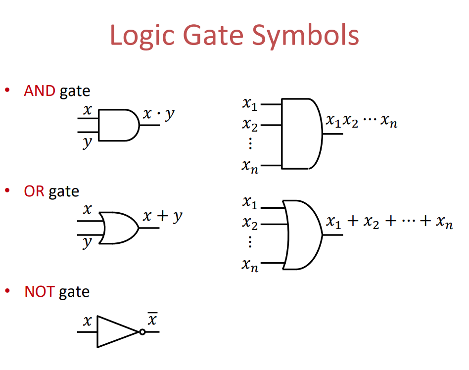
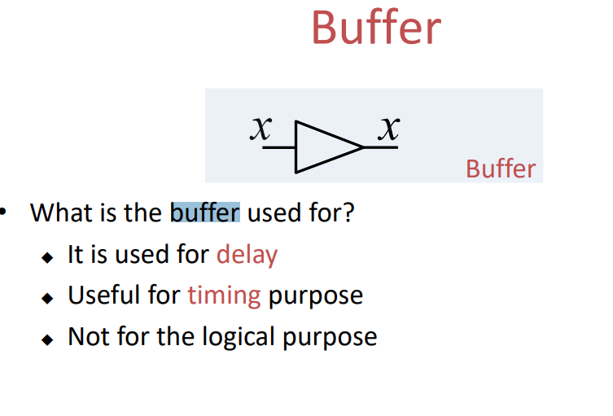
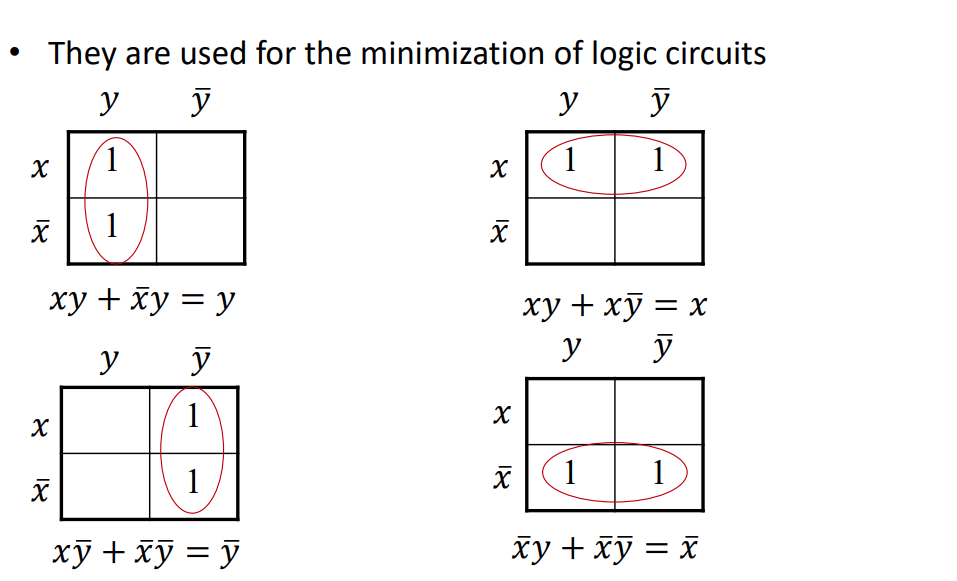
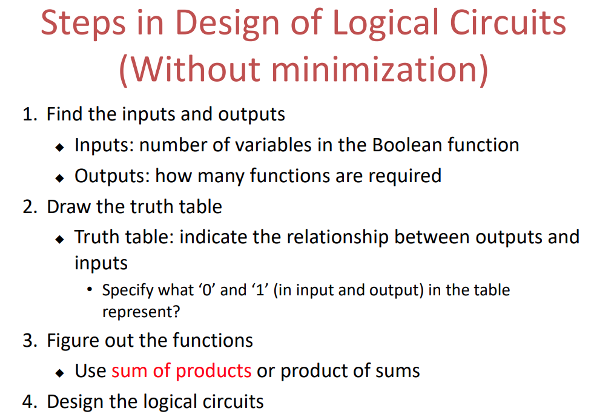

## Topics[^1]
- Logic and proofs
- Set, functions, sequences, and summations
- Counting
- Relations
- Graph theory
- Tree
- Boolean algebra

## Logic and Proofs

### Propositional logic
#### Truth table 
(Given a proposition, draw the truth table)  
#### Logical operators  
Conjunction  ∧  
Disjunction  ∨  
Exclusive OR ⊕
Implication  $→$

### Propositional equivalence  
#### Laws
1. De Morgan’s laws (否定拆括号取反)
2. Distributive(分配) laws
3. $p\rightarrow q=\neg p \vee q$
#### Tautology and contradiction  
Given two propositions, prove they are equivalent   
### Predicates 
Universal quantification   
Existential quantification   
Translate a sentence to a logical expression     

### Proofs
#### Inference rules 推理规则
(prove or disprove an argument)  
- 肯定前件推理 $p\wedge( p \rightarrow q)\Rightarrow q$
- 否定后件推理 $\neg q \wedge(p\rightarrow q) \Rightarrow \neg p$
- 析取三段论
- 假说演绎推理
- 归结推理
#### Argument 
- Valid argument
- Invalid argument
### Proof methods
#### direct proofs   
#### Indirect proofs   
Proof by contraposition(非非反)
Proof by contradiction
#### Existence proof (constructive and non-constructive)    
#### Uniqueness proof (two steps)   
存在且仅存在一个    
假设存在两个满足,然后证明两个相等

## Sets, Functions, Sequences and Summations
### Sets
#### Subset
子集,空集,非空真子集,真子集
#### Powerset
(P(S)=A∣A⊆S)
#### Cardinality
集合元素个数，特别有|P(S)|=$2^n$
#### Cartesian product(笛卡尔积)
全部组合
#### Set operations
#### Set identity
(prove two sets are the same)    
- De Morgan’s Law
#### Laws and membership table
0,1表

### Functions
#### One-to-one functions (injection)
单射,一一对应
#### Onto functions (surjection)
满射,全部y都有x
#### One-to-one and onto functions (bijection)
单加满
#### Special functions
- Ceiling function上
- Floor function下
### Sequences and summations

## Countings
### Rules
#### Product rule
乘法原理
#### Sum rule
加法原理
#### 隔板法

### Principles
#### Inclusion-exclusion principle
容斥
#### Pigeonhole principle
抽屉原理(ceil(n/k))
### Permutation and combination
$$P(n,r)=n!/(n-r)!$$
### Recurrence relation
$$C(n,r)=n!/[(n-r)!*r!]$$
#### Construct a recurrence relation
#### Solve a recurrence relation
$$
a_n=c_1a_{n-1}+c_2a_{n-2}   \\
r^2-c_1r-c_2=0    \\
a_n=k_1r_1^n+k_2r_2^n
$$
## Relations
### Representing relations
There are several other ways to represent relations
- Tables
- Matrices
- Graphs
### Relations on a set
A relation on the set is a relation from 𝐴 to 𝐴
#### Reflexive
(a,a) belongs to R for all element in A
#### Symmetric
对称
#### Anti-symmetric
反对称
#### Transitive
传递性
### Equivalence relation
#### Equivalence relation and Partition
Equivalence relation ⇔ Partition
#### Prove a relation is an equivalence relation.
Reflexive  Symmetric  Transitive
#### Given an equivalence relation, list equivalent classes (give the partition)

## Graph Theory
### Graph 
#### Definition
G=(V,E)
#### Representing graphs (adjacency matrix, adjacency list,  and sketch)
#### Isomorphism
1. 邻接矩阵
2. $bijection f:V_1 \rightarrow V_2: \forall a,b \in V_1((a,b)\in E_1 \leftrightarrow (f(a),f(b))\in E_2)   $

### Eular path and Eular circuit
containing every edge (simple path)   
欧拉回路:each vertex has even degree   
欧拉路径在连通multi: exactly 2 vertices of odd degree
### Hamilton path and Hamilton circuit
each vertex once
#### Ore’s theorem
If for every pair of nonadjacent vertices u and v in the simple graph G with n vertices, deg(u) + deg(v) ≥ n ,then has a Hamilton circuit.
#### Dirac’s theorem
If the degree of each vertex is great than or equals n/2 in the connected simple graph G with n vertices where n ≥ 3, then G has a Hamilton circuit.
### Planar graphs
r=e–v+2
#### Euler’s Formula
>   G is a connected planar simple graph
- v ≥ 3, then e ≤ 3v – 6
- G has a vertex of degree not exceeding 5
- if v>=3 and no circuits of length 3,then e<=2v-4
## Trees
### Tree traversal
#### Preorder traversal
中左1右
#### In-order traversal
左1中右
#### Post-order traversal
左1右中
### Expression forms (conversion among the different forms)
关键
Internal vertices(非叶子节点) represent operations   
Leaves(叶子节点) represent the variables or numbers  
#### Infix
#### prefix 
#### postfix
### Spanning tree
#### DFS
回溯(字母序)
#### BFS
都走(字母序,不重复)

## Boolean Algebra
### Boolean expressions
||||
|-|-|-|
|.| 与|product|
|\+ |或|sum|
|\-| 非|complement|
#### Boolean identities
换成逻辑表达式再换回来记忆
#### min-term(最小项)
A min-term of Boolean variables x1, x2, ⋯ ,xn  is a Boolean product of  literals[^2] y1y2 , ⋯ , yn where yi (1 ≤ i ≤ n ) is either xi or complement of xi
Each min-term has exactly one literal for every variable. 
#### DNF
任何命题公式，最终都能够化成 ( A 1 ∧ A 2 ) ∨ ( A 3 ∧ A 4 )的形式，这种先 ∧ 合 取  再 ∨ 析 取 的范式，被称为 “析取范式”。      

DNF is the unique sum of min-terms of the variables in the expression,Also called sum of products expansion       

SOP是DNF的化简，DNF是SOP的扩展[^3]    

#### Maxterms(最大项)
A max-term of Boolean variables x1, x2, ⋯ ,  is the sum of literals y1 + y2+, ⋯ ,yn + where  (1 ≤ i ≤ n) is either xi or complement of xi
#### CNF
任何命题公式，最终都能够化成 ( A 1 ∨ A 2 ) ∧ ( A 3 ∨ A 4 ) 的形式，这种先 ∨ 析 取  再 ∧ 合 取 的范式，被称为 “ 合取范式”。     

POS同上
> If we have DNF for $\overline F $, then get CNF from $\overline{\overline F} $
#### Equivalence of expressions
#### Funtion completeness
can represent {+  .   ——} using  Operate O
### Logic circuits
#### Logic gates

### Logic circuits

#### Karnaugh maps[^4]

1、取大不取小，圈越大，消去的变量越多，与项越简单，能画入大圈就不画入小圈；   
2、圈数越少，化简后的与项就越少；   
3、一个最小项可以重复使用，即只要需要，一个方格可以同时被多圈所圈  
#### Steps in designing a logic circuit

[^1]: [推荐阅读](https://blog.csdn.net/sinat_21644713/article/details/45896211)
[^2]: A literal is a Boolean variable or its complement.
[^3]: 有些书上定义DNF为SOP，将SOP的扩展叫做CDNF，本文不采用这种定义
[^4]: [可以参考](http://t.csdn.cn/pUBN1)